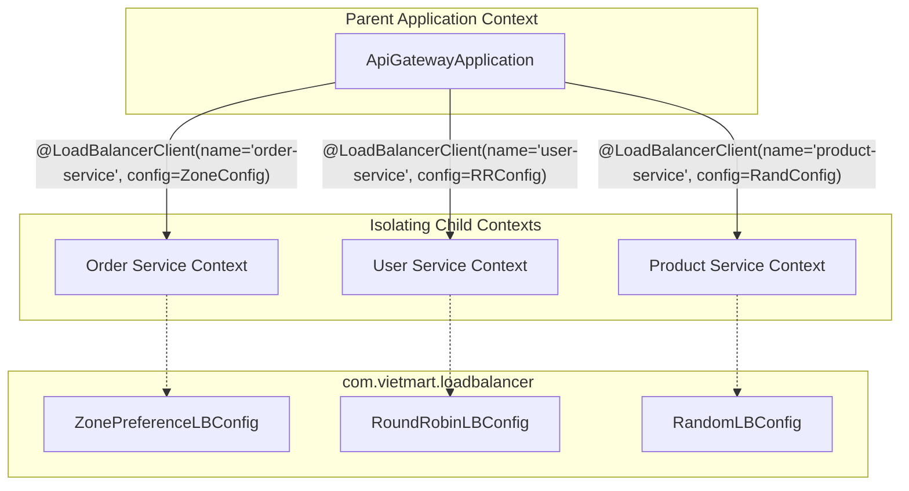

# BÁO CÁO PHÂN TÍCH SỰ CỐ CẤU HÌNH ZONE PREFERENCE

## 1. Phân tích nguyên nhân gốc rễ (Root Cause Analysis)

### Cơ chế hoạt động của Spring Cloud LoadBalancer
Spring Cloud LoadBalancer hoạt động bằng cách tạo ra các **Child Application Context (Context con)** độc lập cho từng Service Client cụ thể. 
- Khi Gateway gọi tới một service (ví dụ: `order-service`), Spring Cloud LoadBalancer sẽ tìm kiếm các Bean cấu hình bổ trợ (như `ServiceInstanceListSupplier`, `ReactorLoadBalancer`) trong Context con dành riêng cho `order-service` đó.
- Nếu không tìm thấy Bean phù hợp trong Context con, nó sẽ chuyển tiếp tìm kiếm lên **Parent Application Context (Context cha)** của ứng dụng.

### Tại sao xảy ra lỗi rò rỉ cấu hình (Configuration Leakage)?
1. **Do vị trí đặt file cấu hình:** File `ZonePreferenceConfig.java` được đặt tại package `com.vietmart.gateway.loadbalancer`.
2. **Do cơ chế Component Scanning:** Lớp chạy chính `ApiGatewayApplication.java` nằm tại package `com.vietmart.gateway` và được đánh dấu bằng `@SpringBootApplication`. Theo mặc định, Spring sẽ tự động quét toàn bộ các class có annotation `@Configuration` nằm trong package chứa ứng dụng chính trở xuống (tức là quét cả package `com.vietmart.gateway.loadbalancer`).
3. **Hậu quả:** Do có annotation `@Configuration`, `ZonePreferenceConfig` bị khởi tạo và đăng ký trực tiếp vào **Parent Context** của Gateway.
4. **Ảnh hưởng tới các Service khác:** Khi `user-service` thực hiện load balancing, Spring Cloud LoadBalancer không thấy cấu hình riêng của nó trong Context con, nên đã fallback lên Parent Context và tìm thấy Bean `ServiceInstanceListSupplier` có kích hoạt `.withZonePreference()` từ `ZonePreferenceConfig`. Do đó, `user-service` vô tình bị ép buộc áp dụng chiến lược Zone Preference giống hệt `order-service`, gây ra hiện tượng toàn bộ request của `user-service` bị dồn hết vào các instance ở zone HCM và bỏ qua zone Hà Nội.

---

## 2. Đề xuất cấu trúc Package đúng

Để giải quyết triệt để lỗi này, ta cần đảm bảo các Class cấu hình LoadBalancer riêng biệt **KHÔNG** được quét bởi `@SpringBootApplication` của Parent Context. Có 2 cách tiếp cận chuẩn:

### Cách 1: Đưa class cấu hình ra ngoài phạm vi quét (Khuyên dùng)
Di chuyển cấu hình LoadBalancer sang một package nằm ngoài luồng quét của Main Application (ví dụ: `com.vietmart.loadbalancer`).

### Cách 2: Loại bỏ `@Configuration` ở class cấu hình
Nếu vẫn muốn giữ cùng thư mục, ta phải bỏ hoàn toàn `@Configuration` ở class cấu hình LoadBalancer và chỉ import nó thông qua `@LoadBalancerClient(configuration = ...)` tại Main Class.

---

## 3. Kiến trúc tổ chức cho hệ thống 5+ Microservices

Khi VietMart mở rộng hệ thống lên nhiều service với các chiến lược Load Balancing khác nhau (ví dụ: Random, Round Robin, Zone Preference, v.v.), cấu trúc tổ chức thư mục nên được chuẩn hóa như sau để dễ quản lý và bảo trì:

```text
com.vietmart
  |-- gateway (Chứa API Gateway chính, được quét tự động)
  |     |-- ApiGatewayApplication.java (Đăng ký @LoadBalancerClients)
  |     |-- controller/ ...
  |     |-- filter/ ...
  |
  |-- loadbalancer (Package độc lập, NẰM NGOÀI vùng quét của Gateway)
        |-- zone/ 
        |     |-- ZonePreferenceLBConfig.java (Dành cho order-service)
        |-- random/
        |     |-- RandomLBConfig.java         (Dành cho product-service)
        |-- roundrobin/
        |     |-- RoundRobinLBConfig.java     (Dành cho user-service)
        |-- weighted/
              |-- WeightedLBConfig.java       (Dành cho inventory-service)
```

### Sơ đồ cơ chế hoạt động sau cải tiến

